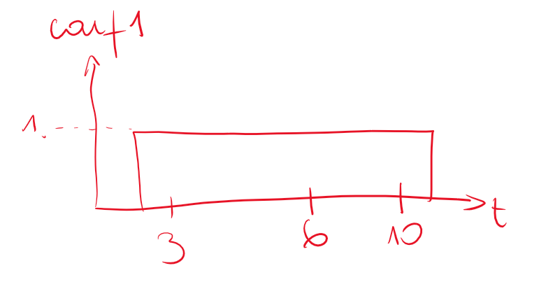
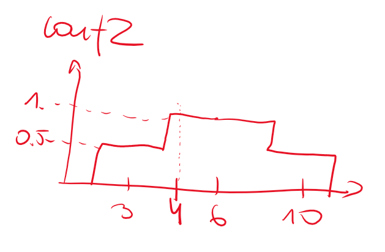
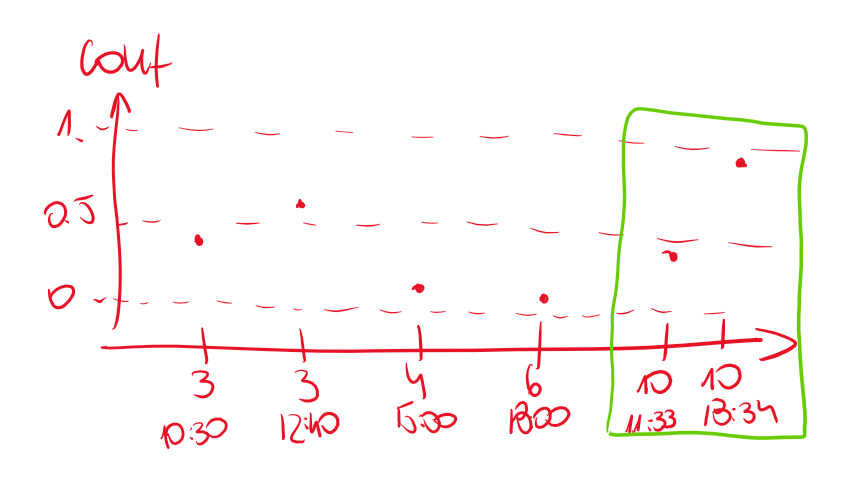
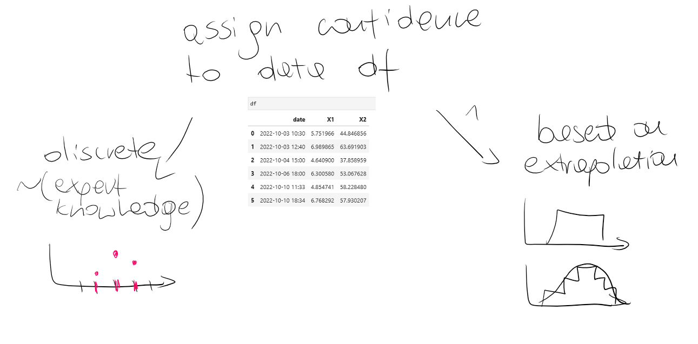

```python
import numpy as np
import pandas as pd
```


```python
df = pd.DataFrame(data=[f"2022-10-{x}" for x in ("03 10:30", "03 12:40", "04 15:00", "06 18:00", "10 11:33", "10 18:34")], columns=["date"])
df["X1"] = np.random.normal(6, 1, size=6)
df["X2"] = np.random.normal(50, 10, size=6)

visits = pd.DataFrame(data=[["2022-10-06", "depression"]], columns=["date", "state"])
```

Our unsupervised sensors data


```python
df
```


<div>
<style scoped>
    .dataframe tbody tr th:only-of-type {
        vertical-align: middle;
    }

    .dataframe tbody tr th {
        vertical-align: top;
    }

    .dataframe thead th {
        text-align: right;
    }
</style>
<table border="1" class="dataframe">
  <thead>
    <tr style="text-align: right;">
      <th></th>
      <th>date</th>
      <th>X1</th>
      <th>X2</th>
    </tr>
  </thead>
  <tbody>
    <tr>
      <th>0</th>
      <td>2022-10-03 10:30</td>
      <td>5.751966</td>
      <td>44.846856</td>
    </tr>
    <tr>
      <th>1</th>
      <td>2022-10-03 12:40</td>
      <td>6.989865</td>
      <td>63.691903</td>
    </tr>
    <tr>
      <th>2</th>
      <td>2022-10-04 15:00</td>
      <td>4.640900</td>
      <td>37.858959</td>
    </tr>
    <tr>
      <th>3</th>
      <td>2022-10-06 18:00</td>
      <td>6.300580</td>
      <td>53.067628</td>
    </tr>
    <tr>
      <th>4</th>
      <td>2022-10-10 11:33</td>
      <td>4.854741</td>
      <td>58.228480</td>
    </tr>
    <tr>
      <th>5</th>
      <td>2022-10-10 18:34</td>
      <td>6.768292</td>
      <td>57.930207</td>
    </tr>
  </tbody>
</table>
</div>


Label information from visits


```python
visits
```


<div>
<style scoped>
    .dataframe tbody tr th:only-of-type {
        vertical-align: middle;
    }

    .dataframe tbody tr th {
        vertical-align: top;
    }

    .dataframe thead th {
        text-align: right;
    }
</style>
<table border="1" class="dataframe">
  <thead>
    <tr style="text-align: right;">
      <th></th>
      <th>date</th>
      <th>state</th>
    </tr>
  </thead>
  <tbody>
    <tr>
      <th>0</th>
      <td>2022-10-06</td>
      <td>depression</td>
    </tr>
  </tbody>
</table>
</div>


Two approaches to extrapolating info from `visits` onto `df`




```python
df["conf1"] = [1. for _ in range(6)]
```


```python
df
```


<div>
<style scoped>
    .dataframe tbody tr th:only-of-type {
        vertical-align: middle;
    }

    .dataframe tbody tr th {
        vertical-align: top;
    }

    .dataframe thead th {
        text-align: right;
    }
</style>
<table border="1" class="dataframe">
  <thead>
    <tr style="text-align: right;">
      <th></th>
      <th>date</th>
      <th>X1</th>
      <th>X2</th>
      <th>conf1</th>
    </tr>
  </thead>
  <tbody>
    <tr>
      <th>0</th>
      <td>2022-10-03 10:30</td>
      <td>5.751966</td>
      <td>44.846856</td>
      <td>1.0</td>
    </tr>
    <tr>
      <th>1</th>
      <td>2022-10-03 12:40</td>
      <td>6.989865</td>
      <td>63.691903</td>
      <td>1.0</td>
    </tr>
    <tr>
      <th>2</th>
      <td>2022-10-04 15:00</td>
      <td>4.640900</td>
      <td>37.858959</td>
      <td>1.0</td>
    </tr>
    <tr>
      <th>3</th>
      <td>2022-10-06 18:00</td>
      <td>6.300580</td>
      <td>53.067628</td>
      <td>1.0</td>
    </tr>
    <tr>
      <th>4</th>
      <td>2022-10-10 11:33</td>
      <td>4.854741</td>
      <td>58.228480</td>
      <td>1.0</td>
    </tr>
    <tr>
      <th>5</th>
      <td>2022-10-10 18:34</td>
      <td>6.768292</td>
      <td>57.930207</td>
      <td>1.0</td>
    </tr>
  </tbody>
</table>
</div>




Both `conf1` and `conf2` are function of `time` only!


```python
df["conf2"] = [0.5, 0.5, 1.0, 1.0, 0.5, 0.5]
```


```python
df
```


<div>
<style scoped>
    .dataframe tbody tr th:only-of-type {
        vertical-align: middle;
    }

    .dataframe tbody tr th {
        vertical-align: top;
    }

    .dataframe thead th {
        text-align: right;
    }
</style>
<table border="1" class="dataframe">
  <thead>
    <tr style="text-align: right;">
      <th></th>
      <th>date</th>
      <th>X1</th>
      <th>X2</th>
      <th>conf1</th>
      <th>conf2</th>
    </tr>
  </thead>
  <tbody>
    <tr>
      <th>0</th>
      <td>2022-10-03 10:30</td>
      <td>5.751966</td>
      <td>44.846856</td>
      <td>1.0</td>
      <td>0.5</td>
    </tr>
    <tr>
      <th>1</th>
      <td>2022-10-03 12:40</td>
      <td>6.989865</td>
      <td>63.691903</td>
      <td>1.0</td>
      <td>0.5</td>
    </tr>
    <tr>
      <th>2</th>
      <td>2022-10-04 15:00</td>
      <td>4.640900</td>
      <td>37.858959</td>
      <td>1.0</td>
      <td>1.0</td>
    </tr>
    <tr>
      <th>3</th>
      <td>2022-10-06 18:00</td>
      <td>6.300580</td>
      <td>53.067628</td>
      <td>1.0</td>
      <td>1.0</td>
    </tr>
    <tr>
      <th>4</th>
      <td>2022-10-10 11:33</td>
      <td>4.854741</td>
      <td>58.228480</td>
      <td>1.0</td>
      <td>0.5</td>
    </tr>
    <tr>
      <th>5</th>
      <td>2022-10-10 18:34</td>
      <td>6.768292</td>
      <td>57.930207</td>
      <td>1.0</td>
      <td>0.5</td>
    </tr>
  </tbody>
</table>
</div>


Note that calls from one day have the same `confidence factor` assigned as the key is `date`, not `datetime`. In fact


```python
df.insert(0, 'level1_day', [1, 1, 2, 3, 4, 4])
df.insert(1, 'level2_hour', [1, 2, 1, 1, 1, 2])
```


```python
df
```


<div>
<style scoped>
    .dataframe tbody tr th:only-of-type {
        vertical-align: middle;
    }

    .dataframe tbody tr th {
        vertical-align: top;
    }

    .dataframe thead th {
        text-align: right;
    }
</style>
<table border="1" class="dataframe">
  <thead>
    <tr style="text-align: right;">
      <th></th>
      <th>level1_day</th>
      <th>level2_hour</th>
      <th>date</th>
      <th>X1</th>
      <th>X2</th>
      <th>conf1</th>
      <th>conf2</th>
    </tr>
  </thead>
  <tbody>
    <tr>
      <th>0</th>
      <td>1</td>
      <td>1</td>
      <td>2022-10-03 10:30</td>
      <td>5.751966</td>
      <td>44.846856</td>
      <td>1.0</td>
      <td>0.5</td>
    </tr>
    <tr>
      <th>1</th>
      <td>1</td>
      <td>2</td>
      <td>2022-10-03 12:40</td>
      <td>6.989865</td>
      <td>63.691903</td>
      <td>1.0</td>
      <td>0.5</td>
    </tr>
    <tr>
      <th>2</th>
      <td>2</td>
      <td>1</td>
      <td>2022-10-04 15:00</td>
      <td>4.640900</td>
      <td>37.858959</td>
      <td>1.0</td>
      <td>1.0</td>
    </tr>
    <tr>
      <th>3</th>
      <td>3</td>
      <td>1</td>
      <td>2022-10-06 18:00</td>
      <td>6.300580</td>
      <td>53.067628</td>
      <td>1.0</td>
      <td>1.0</td>
    </tr>
    <tr>
      <th>4</th>
      <td>4</td>
      <td>1</td>
      <td>2022-10-10 11:33</td>
      <td>4.854741</td>
      <td>58.228480</td>
      <td>1.0</td>
      <td>0.5</td>
    </tr>
    <tr>
      <th>5</th>
      <td>4</td>
      <td>2</td>
      <td>2022-10-10 18:34</td>
      <td>6.768292</td>
      <td>57.930207</td>
      <td>1.0</td>
      <td>0.5</td>
    </tr>
  </tbody>
</table>
</div>


---

We use one of the `confidence factor` columns in a modelling procedure

```python
model1 = SSFCM_with_CPR(data=df, confidence_factor=conf1)
model1["estimated_conf"]
```

It yields `adjusted confidence factor`


```python
s = np.round(np.random.uniform(0, 1, 6), 2)
```


```python
s
```


    array([0.47, 0.58, 0.05, 0.02, 0.44, 0.95])


```python
df["conf1_adjusted"] = s
```


```python
df
```


<div>
<style scoped>
    .dataframe tbody tr th:only-of-type {
        vertical-align: middle;
    }

    .dataframe tbody tr th {
        vertical-align: top;
    }

    .dataframe thead th {
        text-align: right;
    }
</style>
<table border="1" class="dataframe">
  <thead>
    <tr style="text-align: right;">
      <th></th>
      <th>level1_day</th>
      <th>level2_hour</th>
      <th>date</th>
      <th>X1</th>
      <th>X2</th>
      <th>conf1</th>
      <th>conf2</th>
      <th>conf1_adjusted</th>
    </tr>
  </thead>
  <tbody>
    <tr>
      <th>0</th>
      <td>1</td>
      <td>1</td>
      <td>2022-10-03 10:30</td>
      <td>5.751966</td>
      <td>44.846856</td>
      <td>1.0</td>
      <td>0.5</td>
      <td>0.47</td>
    </tr>
    <tr>
      <th>1</th>
      <td>1</td>
      <td>2</td>
      <td>2022-10-03 12:40</td>
      <td>6.989865</td>
      <td>63.691903</td>
      <td>1.0</td>
      <td>0.5</td>
      <td>0.58</td>
    </tr>
    <tr>
      <th>2</th>
      <td>2</td>
      <td>1</td>
      <td>2022-10-04 15:00</td>
      <td>4.640900</td>
      <td>37.858959</td>
      <td>1.0</td>
      <td>1.0</td>
      <td>0.05</td>
    </tr>
    <tr>
      <th>3</th>
      <td>3</td>
      <td>1</td>
      <td>2022-10-06 18:00</td>
      <td>6.300580</td>
      <td>53.067628</td>
      <td>1.0</td>
      <td>1.0</td>
      <td>0.02</td>
    </tr>
    <tr>
      <th>4</th>
      <td>4</td>
      <td>1</td>
      <td>2022-10-10 11:33</td>
      <td>4.854741</td>
      <td>58.228480</td>
      <td>1.0</td>
      <td>0.5</td>
      <td>0.44</td>
    </tr>
    <tr>
      <th>5</th>
      <td>4</td>
      <td>2</td>
      <td>2022-10-10 18:34</td>
      <td>6.768292</td>
      <td>57.930207</td>
      <td>1.0</td>
      <td>0.5</td>
      <td>0.95</td>
    </tr>
  </tbody>
</table>
</div>


Note this is a first step of CPR procedure - estimating `adjusted confidence factor` based on data. <br>

We may want now to use in a final model.

```python
model2 = SSFCM(data=df, confidence_factor=conf1_adjusted)
```

In such a model, we are no longer interested in estimating `adjusted confidence factor` - now it's a classifier and accuracy that are of interest.

We use adjusted confidence factor just to reflect the true (estimated) label uncertainty impact on the key mechanism of interest - the accuracy of a SSFCM classifier.

Note that the `conf1_adjusted` values are now on `level2_hour` - unique value of `adjusted confidence` for each single call, not for each single day!

It now has nothing (directly) to do with the `confidence factor`, but the mechanism of assigning label certainty should be the same, although discrete
:



Note: two calls from "2022-10-10" have different values of `confindence factor` fed to the algorithm!

Technically, we want:




```python

```
